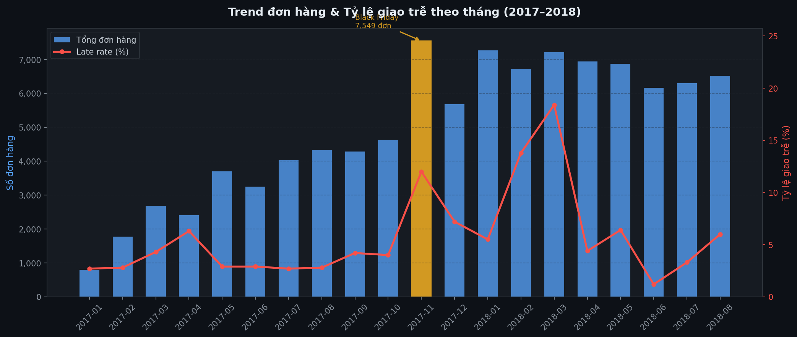
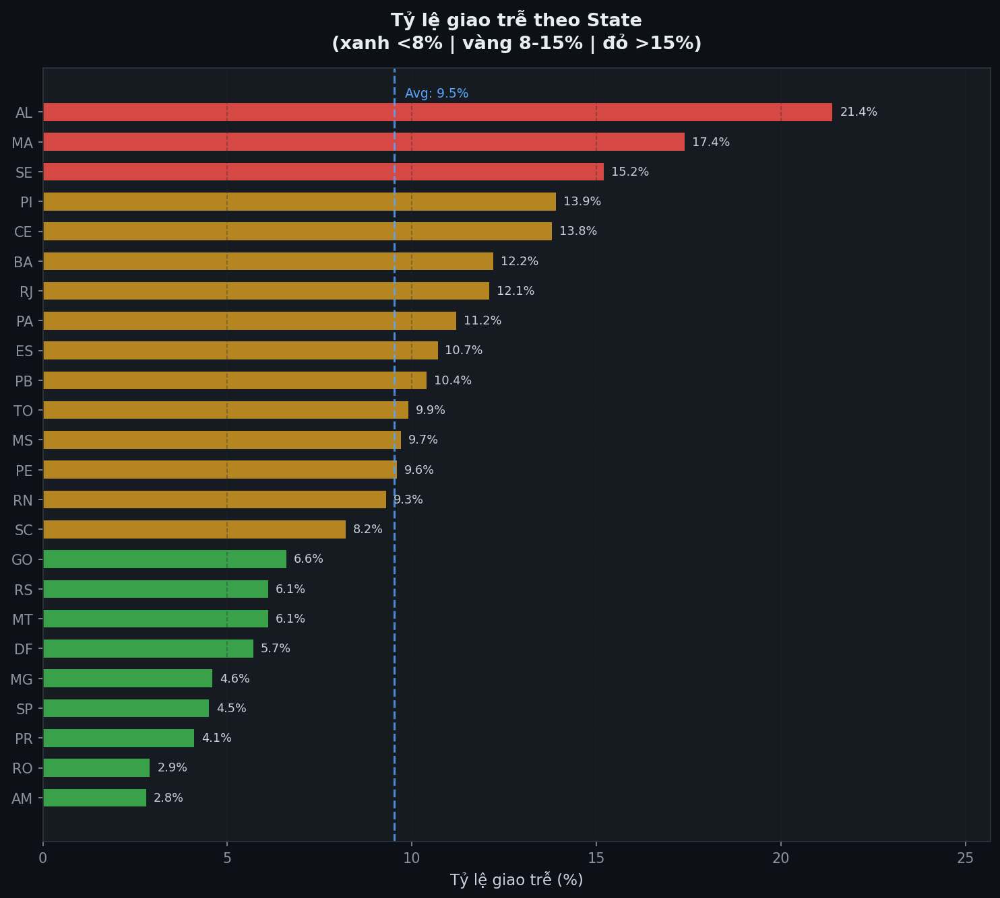
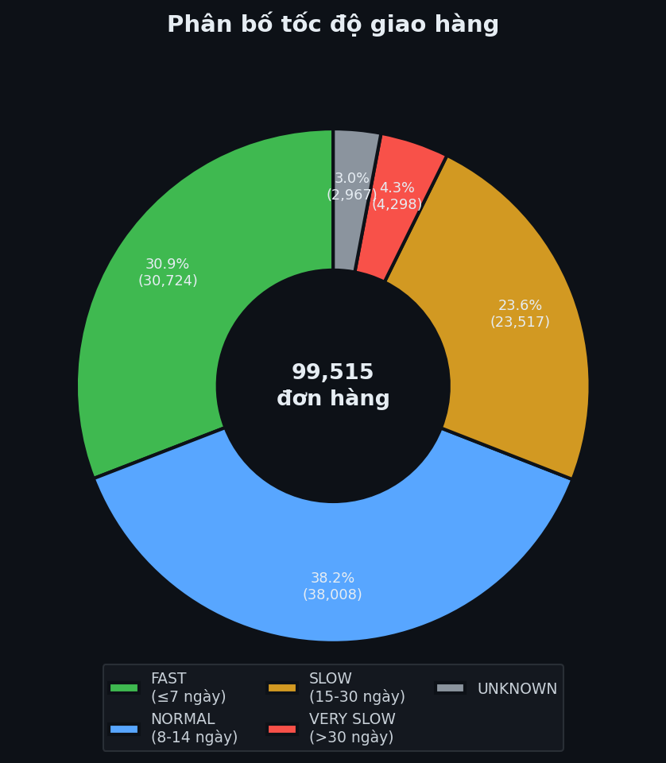

# Masan Logistics Data Pipeline
> Mô phỏng kiến trúc Palantir Foundry — xử lý 1M+ rows với PySpark theo mô hình Medallion (Bronze → Silver → Gold)

---

## Bối cảnh

Tại **Masan Group**, dữ liệu logistics đến từ nhiều hệ thống riêng biệt: ERP (đơn hàng), CRM (khách hàng), và hệ thống Logistics (tọa độ giao hàng). Các nguồn này có schema không đồng nhất, chất lượng dữ liệu không đảm bảo, và khối lượng lên đến hàng triệu bản ghi.

Project này mô phỏng lại quy trình xây dựng data pipeline theo phong cách **Palantir Foundry** — từ kết nối nguồn dữ liệu thô đến tạo ra KPI sẵn sàng cho analyst — sử dụng dataset OLIST Brazil (e-commerce thực tế) làm dữ liệu thay thế.

---

## Kiến trúc Pipeline

```
┌─────────────────────────────────────────────────────────────────┐
│                        DATA SOURCES                             │
│   ERP (Orders)      CRM (Customers)     Logistics (Geolocation) │
│   99,441 rows       99,441 rows         1,000,163 rows          │
└────────────┬───────────────┬─────────────────┬──────────────────┘
             │               │                 │
             ▼               ▼                 ▼
┌─────────────────────────────────────────────────────────────────┐
│                    DATA INGESTION LAYER                         │
│  connector.py — Định nghĩa Source, validate schema tự động      │
│  schema_validator.py — Kiểm tra join compatibility giữa nguồn   │
└──────────────────────────────┬──────────────────────────────────┘
                               │
                               ▼
┌─────────────────────────────────────────────────────────────────┐
│                    BRONZE LAYER  (Raw)                          │
│  spark_processor.py                                             │
│  • Join 3 nguồn bằng PySpark                                    │
│  • Dedup geolocation: 1,000,163 → 19,023 unique zip codes       │
│  • Output: Parquet + Snappy (~88% nhỏ hơn CSV gốc)             │
│  • 99,515 rows | 18 columns                                     │
└──────────────────────────────┬──────────────────────────────────┘
                               │
                               ▼
┌─────────────────────────────────────────────────────────────────┐
│                    SILVER LAYER  (Cleaned)                      │
│  silver_processor.py                                            │
│  • Fix 5 timestamp columns: string → datetime                   │
│  • Impute 278 đơn thiếu tọa độ (avg by state)                  │
│  • Phát hiện và fix 8 tọa độ ngoài biên giới Brazil            │
│  • Tính: actual_delivery_days, delay_days, delivery_speed       │
│  • Partition theo year/month → query nhanh hơn                  │
│  • Data Quality: 4/4 checks PASS                                │
└──────────────────────────────┬──────────────────────────────────┘
                               │
                               ▼
┌─────────────────────────────────────────────────────────────────┐
│                    GOLD LAYER  (Analyst-Ready)                  │
│  gold_processor.py                                              │
│  • KPI 1: Hiệu suất giao hàng theo State (27 states)           │
│  • KPI 2: Trend đơn hàng theo tháng (2016–2018)                │
│  • KPI 3: Phân tích đơn giao trễ theo severity                 │
│  • KPI 4: Executive Summary                                     │
│  • Output: CSV + Parquet sẵn sàng cho analyst                  │
└─────────────────────────────────────────────────────────────────┘
```

---

## Key Insights từ Data

| Metric | Giá trị | Ý nghĩa với Masan |
|--------|---------|-------------------|
| Tổng đơn hàng | 99,515 | — |
| Tỷ lệ giao thành công | 97.0% | Benchmark logistics partner |
| Trung bình ngày giao | 12.5 ngày | SLA baseline |
| Tỷ lệ giao trễ | 6.6% (6,539 đơn) | Target cải thiện |
| Đơn giao nhanh ≤7 ngày | 30.9% | Tiềm năng tăng trải nghiệm |
| State chậm nhất | RR — 29.3 ngày | Cần SLA riêng |
| State nhanh nhất | SP — 8.7 ngày | Benchmark nội bộ |
| Tháng cao điểm | 2017-11 (Black Friday) | Late rate tăng 4% → 12% |
| Đơn CRITICAL (trễ >14 ngày) | 1,385 đơn, max 188 ngày | Ưu tiên xử lý khiếu nại |

---

## Cấu trúc thư mục

```
masan_palantir/
│
├── data_source/                    # Raw CSV inputs (không commit lên Git)
│   ├── orders.csv                  # ERP: 99,441 đơn hàng
│   ├── customers.csv               # CRM: 99,441 khách hàng
│   └── geolocation.csv             # Logistics: 1,000,163 tọa độ
│
├── connector.py                    # Data Ingestion — kết nối và validate source
├── schema_validator.py             # Schema Enforcement — kiểm tra join compatibility
├── spark_processor.py              # Bronze Layer — join 3 nguồn với PySpark
├── silver_processor.py             # Silver Layer — clean, normalize, derived columns
├── gold_processor.py               # Gold Layer — KPI, aggregation, executive summary
│
├── bronze_layer/                   # Output Bronze (Parquet/Snappy)
│   └── orders_enriched/
│
├── silver_layer/                   # Output Silver (Parquet, partitioned)
│   └── orders_cleaned/
│       ├── order_year=2016/
│       ├── order_year=2017/
│       └── order_year=2018/
│
└── gold_layer/                     # Output Gold (CSV + Parquet)
    ├── executive_summary.csv
    ├── kpi_delivery_by_state.csv
    ├── kpi_monthly_trend.csv
    └── kpi_late_orders.csv
```

---

## Tech Stack

| Layer | Tool | Lý do chọn |
|-------|------|------------|
| Ingestion | Python + Pandas | Kết nối nguồn, validate schema nhẹ |
| Processing | PySpark 4.1 | Xử lý 1M+ rows, parallel execution |
| Storage | Parquet + Snappy | Columnar, nén tốt, query nhanh |
| Partitioning | year/month | Tối ưu query theo thời gian |
| Runtime | Java 17 + Miniconda | Tương thích PySpark 4.x |

---

## Palantir Foundry Mapping

Mỗi thành phần trong project tương đương với khái niệm trong Palantir Foundry:

| Project này | Palantir Foundry | Mô tả |
|-------------|-----------------|-------|
| `connector.py` | Data Connection | Định nghĩa nguồn, enforce schema ngay khi kết nối |
| `schema_validator.py` | Schema Enforcement | Kiểm tra join key compatibility trước khi process |
| Bronze Layer | Raw Dataset | Dữ liệu thô, không transform, giữ lineage |
| Silver Layer | Foundry Transform | Clean, normalize, tính derived columns |
| Gold Layer | Ontology / View | KPI sẵn sàng cho analyst và dashboard |
| Partition by year/month | Dataset Branches | Tối ưu access pattern theo thời gian |

---

## Chạy Pipeline

### Yêu cầu

```bash
# Python 3.10+
pip install pyspark pandas

# Java 17 (bắt buộc cho PySpark 4.x)
sudo apt install openjdk-17-jdk -y
export JAVA_HOME=/usr/lib/jvm/java-17-openjdk-amd64
```

### Chuẩn bị data

Tải dataset đặt vào `data_source/` và đổi tên:

```
→ data_source/orders.csv
→ data_source/customers.csv
→ data_source/geolocation.csv
```

### Chạy từng bước

```bash
# Bước 1 — Kiểm tra kết nối và schema
python connector.py

# Bước 2 — Validate join compatibility giữa 3 nguồn
python schema_validator.py

# Bước 3 — Tạo Bronze Layer (join + Parquet)
python spark_processor.py

# Bước 4 — Tạo Silver Layer (clean + normalize)
python silver_processor.py

# Bước 5 — Tạo Gold Layer (KPI + executive summary)
python gold_processor.py
```

### Kết quả mong đợi

```
connector.py      → 3 sources kết nối thành công, schema validated
schema_validator  → match rate 100% (orders↔customers), 99% (customers↔geo)
spark_processor   → bronze_layer/orders_enriched/ (Parquet)
silver_processor  → silver_layer/orders_cleaned/ (partitioned Parquet, 4/4 DQ checks PASS)
gold_processor    → gold_layer/*.csv (KPI analyst-ready)
```

---

## Charts







---

## Những điểm kỹ thuật đáng chú ý

**Schema-first approach** — Không dùng `inferSchema=True`. Mọi schema đều khai báo tường minh trong `SPARK_SCHEMAS` và `EXPECTED_SCHEMAS`. Đây là nguyên tắc bắt buộc trong Palantir Foundry để đảm bảo data lineage.

**Không xóa data ở Bronze** — Bronze giữ nguyên 99,515 rows, kể cả dòng có null. Việc xử lý null chỉ xảy ra ở Silver, và mọi quyết định đều được log rõ lý do (`NOT_YET_DELIVERED`, `DATA_QUALITY_ISSUE`).

**Imputation có kiểm soát** — Tọa độ thiếu được fill bằng trung bình của cùng state, không phải trung bình toàn bộ dataset. Cột `geo_imputed` đánh dấu các dòng đã được impute để analyst biết.

**Data Quality gate** — Silver không lưu nếu DQ check FAIL. Đây là pattern quan trọng trong production pipeline để ngăn data xấu lan sang Gold.

**Partition strategy** — Silver partition theo `order_year/order_month`. Query `WHERE order_year=2018 AND order_month=11` chỉ đọc 1 partition thay vì toàn bộ dataset.

---

## Dataset


Dataset thực tế gồm 100k đơn hàng từ 2016–2018, bao gồm thông tin đơn hàng, khách hàng, sản phẩm, người bán, logistics và đánh giá.

---

*Built as a Data Engineering portfolio project — simulating Palantir Foundry workflows with open-source tools.*